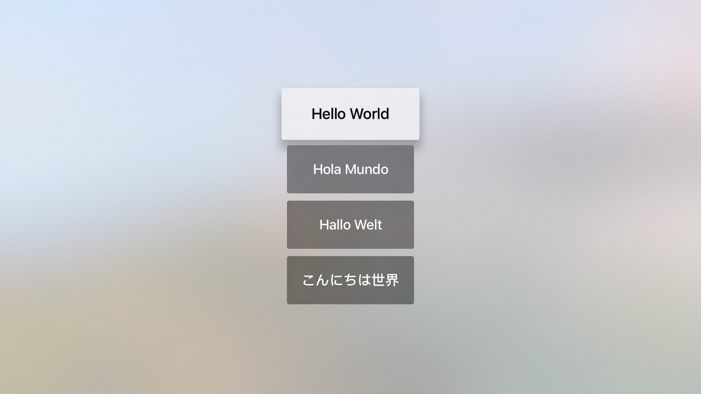
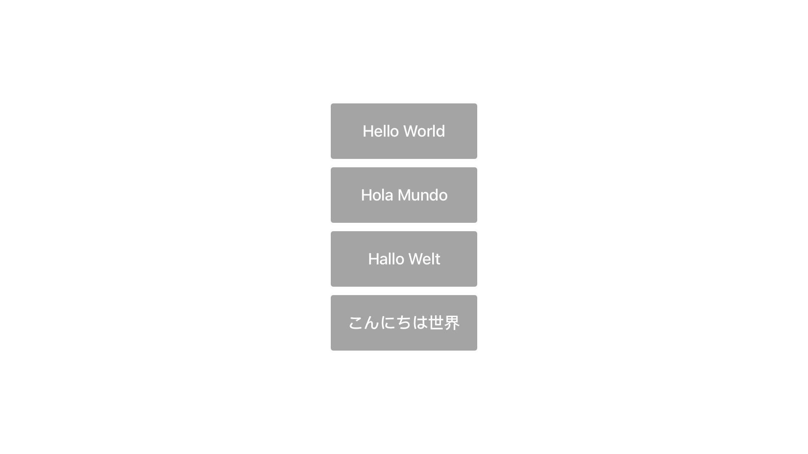

# tvOS-SnapshotTesting

Result of trying to do Snapshot testing with [FBSnapshotTestCase](https://github.com/facebook/ios-snapshot-test-case) in a tvOS project. 

**Runtime layout** vs **Layout got as result of testing**:



* Same result adding the following code:

```swift
let date = Date(timeIntervalSinceNow: 1.0)
RunLoop.current.run(until: date)
```

Related issue: https://github.com/facebook/ios-snapshot-test-case/issues/52
